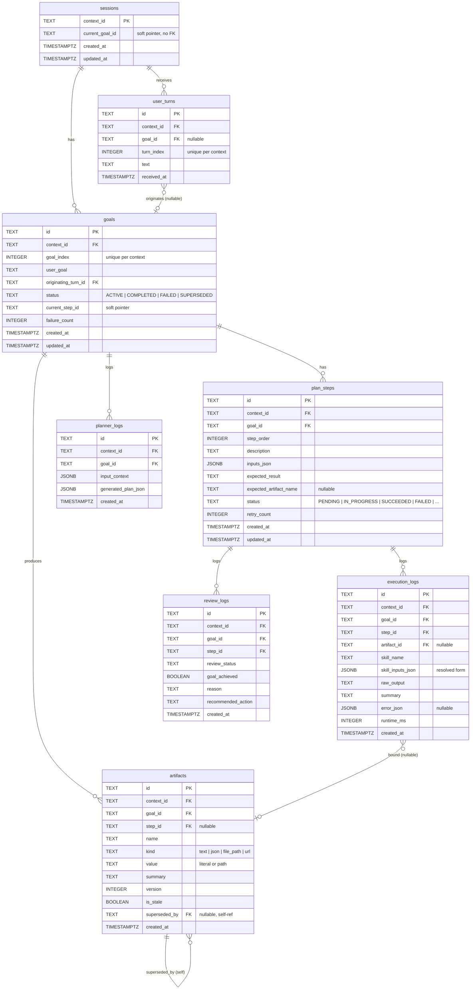

# Database Schema

All conversation state is persisted in PostgreSQL. Every table is keyed on `context_id`, the A2A `contextId` carried on incoming messages — this is how resume works across requests. A single `contextId` can contain many **goals**, each produced by a **user turn**. Step outputs can be registered as named **artifacts** that later steps reference via `@{name}` substitution in their inputs.

## Entity-relationship diagram

## Key relationships

- **`sessions.context_id`** is the root primary key. Every other table has a `context_id` FK referencing it with `ON DELETE CASCADE`, so deleting a session nukes the whole conversation.
- **`sessions.current_goal_id`** is a soft pointer (no FK) to the active goal on this conversation. Written when a goal is created; read on every inbound turn to decide whether to create a new goal or supersede the current one.
- **`user_turns.goal_id`** is nullable. A turn is written as soon as the A2A message arrives; the runner then creates a goal and binds the turn's `goal_id` in the same transaction. If the process crashes between those two steps the turn is retained as a record of inbound text with `goal_id = NULL`.
- **`goals`** is the unit of work. `(context_id, goal_index)` is unique. `goal_index` increments monotonically per context. `status` is one of `ACTIVE`, `COMPLETED`, `FAILED`, `SUPERSEDED` — a new inbound turn while a goal is `ACTIVE` causes that goal to be marked `SUPERSEDED`.
- **`plan_steps` / `execution_logs` / `review_logs` / `planner_logs`** each carry both `goal_id` (logical parent) and `context_id` (denormalized, for single-index conversation-wide queries). Log tables are append-only; retries and review cycles produce new rows.
- **`artifacts`** form a versioned registry per `(context_id, name)`. When a new artifact is created with a name that already has an active version, the existing row's `superseded_by` is set to the new id and the new row's `version` is incremented. The partial unique index `artifacts_current ON (context_id, name) WHERE superseded_by IS NULL` enforces at most one active version per name per context.
- **`execution_logs.artifact_id`** binds a successful execution to the artifact it produced (set only when the step's `expected_artifact_name` was declared and review passed).

## Cardinality summary

| Parent | Child | Cardinality | Notes |
|--------|-------|-------------|-------|
| `sessions` | `user_turns` | 1 : N | all inbound A2A messages |
| `sessions` | `goals` | 1 : N | ordered by `goal_index` |
| `goals` | `plan_steps` | 1 : N | ordered by `step_order` |
| `goals` | `planner_logs` | 1 : N | one per planner invocation |
| `goals` | `artifacts` | 1 : N | provenance of produced artifacts |
| `plan_steps` | `execution_logs` | 1 : N | append-only; one per attempt |
| `plan_steps` | `review_logs` | 1 : N | append-only |
| `artifacts` | `artifacts` | 1 : 1 | self-ref via `superseded_by` |

## Turn-to-goal lifecycle

1. A2A message arrives → `user_turns` row inserted with `goal_id = NULL`, `turn_index = max+1`.
2. Runner resolves current goal:
   - None or terminal (`COMPLETED`/`FAILED`/`SUPERSEDED`) → create new goal; bind turn.
   - `ACTIVE` → mark it `SUPERSEDED`; create new goal; bind turn.
3. Runner drives plan → execute → review until goal is terminal.

## Artifact references

A `plan_steps.inputs_json` value may contain strings with `@{name}` tokens. Before executing, the runner walks the inputs and substitutes each token with the current non-superseded artifact's `value`. For `kind = file_path`, a `Path.exists()` check is done; missing files flip `is_stale = true` on the artifact (the substitution still happens — files are best-effort). Unresolved names remain as literal `@{name}` and are surfaced on `execution_logs.error_json` under `missing_artifacts`.

## Resume logic (`get_resume_point_for_current_goal`)

`persistence/session_store.py` walks the schema scoped to the session's current goal:

1. No session / no current goal → `AWAIT_NEW_GOAL` (runner creates a goal from the inbound turn).
2. Current goal is `COMPLETED` / `FAILED` / `SUPERSEDED` → `AWAIT_NEW_GOAL` (same).
3. No `goals.current_step_id` → `RUN_PLANNER`.
4. No `execution_logs` row for the current step → `RUN_EXECUTOR`.
5. No `review_logs` row for the latest execution → `RUN_REVIEWER`.
6. Otherwise → `RUN_PLANNER` (plan next step).
